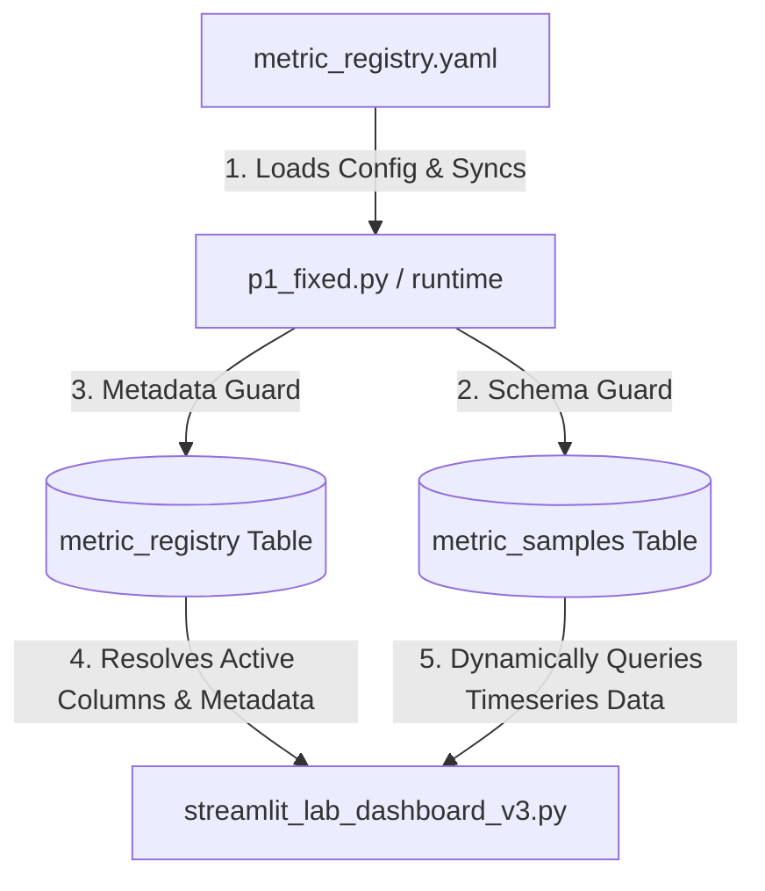

# System Architecture, Metrics Registry, and Workflow Reference

This document serves as a persistent, cumulative knowledge base for the metrics addition, monitoring runtime, and dashboard visualization workflow. It will be updated over time to append new questions, troubleshooting steps, and architectural notes.

---

## 1. Dynamic Metric Addition & Dashboard Handling

### How New Metrics Are Handled in the Dashboard
The Streamlit dashboard ([streamlit_lab_dashboard_v3.py](file:///home/vagrant/.hermes/skills/new-metric-addition/streamlit_lab_dashboard_v3.py)) is designed to be **entirely dynamic**. It does not contain any hardcoded references to custom metrics. Instead, it relies on two database tables: `metric_registry` (the catalog of metrics) and `metric_samples` (the timeseries table containing the metrics' values).

When the dashboard loads or is refreshed:
1. **Catalog Resolution**: It calls `load_metric_registry()`, which queries the PostgreSQL `metric_registry` table:
   ```sql
   SELECT metric_key, display_name, column_name, unit, chart_group, preferred_viz, threshold_warning, threshold_critical, enabled
   FROM metric_registry
   WHERE enabled = true
   ORDER BY chart_group, display_name;
   ```
2. **Sanitization**: For security, each fetched column name is validated using a regex identifier filter:
   ```python
   SAFE_SQL_IDENTIFIER = re.compile(r"^[a-z][a-z0-9_]{1,62}$")
   ```
3. **Dynamic Query Formulation**: In `_fetch_metric_samples()`, the dashboard constructs the SQL query dynamically by appending the active custom columns from the registry to the SELECT list:
   ```python
   custom_select_sql = ""
   for col in custom_cols:
       custom_select_sql += f",\n            ms.{col}"
   ```
   This constructs a query against the `metric_samples` table (`ms`) selecting all core columns plus the dynamically resolved custom columns.
4. **Automatic Rendering**: The dashboard loops over the returned registry metadata to automatically render corresponding charts, using the specified `preferred_viz` (e.g., line charts, areas), units, and warning/critical threshold lines. No frontend code modifications are required.

---

### What Happens When a Column is Deleted/Dropped?
Because the query formulation is dynamic and relies on the state of the `metric_registry` table, we have a potential mismatch condition:

#### The Mismatch Scenario
If a column is dropped from the physical database table `metric_samples`, but the corresponding record remains in the `metric_registry` table with `enabled = true`, the dashboard would historically attempt to retrieve the deleted column's name, construct a query selecting `ms.deleted_column_name`, and fail with a PostgreSQL error (`psycopg2.errors.UndefinedColumn`), crashing the dashboard views.

#### The Automated Self-Healing Mechanism
To prevent dashboard crashes when a database column is physically removed before updating the registry, the dashboard implements an **automated self-healing check** inside `load_metric_registry()`:
1. **Catalog Scan**: On registry load, the dashboard fetches the list of actual columns currently present in the `metric_samples` table by executing a lightweight, zero-row query:
   ```sql
   SELECT * FROM metric_samples LIMIT 0
   ```
2. **Mismatch Detection**: It compares the `column_name` from the registered metrics against the physical column names returned in the table description.
3. **Automatic Disabling**: If any registered metric's column does not exist in `metric_samples`:
   - It issues an asynchronous/background UPDATE statement to the database to mark `enabled = false` for that metric:
     ```sql
     UPDATE metric_registry SET enabled = false WHERE column_name = %s;
     ```
   - It immediately **filters out the missing metric from the returned registry in memory** for the current render.
4. **Resiliency**: Even if the database is in a read-only state or the update statement fails, the in-memory filtering still guarantees that the dashboard will not attempt to select the non-existent column, **completely preventing any SQL exception or dashboard crash**.

#### Safe Column Deletion/Disabling Workflow (Manual)
Even with the self-healing layer active, the best-practice manual retiring workflow remains:
1. **Disable the Metric in the Registry**: Set `enabled: false` in `metric_registry.yaml`.
2. **Synchronize Registry**: Run the monitoring agent (`p1_fixed.py` or the collector) so that `db_sync_metric_registry()` updates the database table, or execute the SQL command manually:
   ```sql
   UPDATE metric_registry SET enabled = false WHERE column_name = 'your_column';
   ```
3. **Verify Dashboard Stability**: Ensure the dashboard loads perfectly.
4. **Physically Drop the Column (Optional)**: It is now safe to physically drop the column from the database without breaking the dashboard:
   ```sql
   ALTER TABLE metric_samples DROP COLUMN your_column;
   ```

---

### What Happens When a Column is Added to the DB, but NOT in `metric_registry`?
If a column is physically added to `metric_samples`, but is either missing from the `metric_registry` table or marked as `enabled = false`:
- The dashboard is completely unaffected.
- Since it only selects custom columns listed in the enabled registry DataFrame, it will simply skip querying this column. No error is raised, and the column remains invisible on the dashboard.

---

## 2. The Role of the `metric_registry` Table

The `metric_registry` table in the database acts as a **metadata-driven decoupling layer** between raw timeseries telemetry data and the user interface.



### Purpose & Responsibilities:
1. **Discovery**: It tells the dashboard which custom metrics are currently active and queryable.
2. **Display & Styling**: It stores presentation parameters such as `display_name` (human-readable title), `unit` (e.g. `%`, `ms`, `MB`), and `chart_group` (collapsible sections on the dashboard).
3. **Visualization Strategy**: The `preferred_viz` column dictates how the Streamlit dashboard should render the metric (e.g. `line` chart or `area` chart).
4. **Alert Thresholds**: The `threshold_warning` and `threshold_critical` columns store the boundary limits, which are drawn as horizontal guides on charts and used to highlight potential server anomalies.
5. **Decoupled Strategy**: It permits the running collection frequency (e.g., cron jobs, collector scripts) to be separate from the presentation layer. New scripts can be added, disabled, or configured entirely from database rows or YAML configurations without modifying Python files in the dashboard.

---

## 3. Reference Workflow: Adding a New Metric

To register and start collecting a brand-new custom metric, use the following sequence:

| Step | Action | Description |
| :--- | :--- | :--- |
| **1** | **Write Script** | Create a Python script in `new-metrics/` (e.g., `new-metrics/inode_usage_percentage.py`). It must output a valid JSON containing `{"value": float_or_int, "status": "ok", "raw_output": "text"}`. |
| **2** | **Update YAML** | Add an entry to `metric_registry.yaml` specifying `column_name`, `db_type`, `unit`, `script` path, and ensure `enabled: true`. |
| **3** | **Sync Schema & Registry** | Execute/run the monitoring system (or wait for the cron runner). This triggers:<br>• `db_ensure_custom_metric_columns()` which executes `ALTER TABLE metric_samples ADD COLUMN IF NOT EXISTS ...`<br>• `db_sync_metric_registry()` which upserts the metadata into the DB table. |
| **4** | **Verify Dashboard** | Launch or reload the Streamlit dashboard. The dashboard automatically discovers the new column, pulls its values, and plots the graph. |
